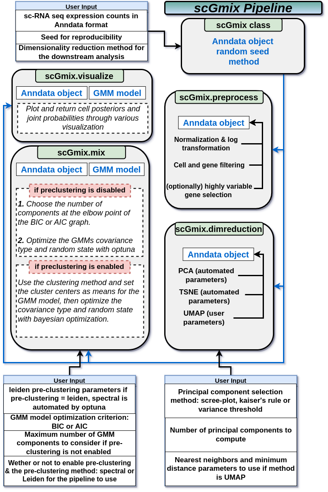

# scGMix a Pipeline for Single Cell Gaussian Mixture Models
**scGmix** is a tool written in Python and designed for intuitively discovering cell states from scRNA-seq datasets. The pipeline seamlessly integrates multiple functionalities, including data preprocessing with quality control and appropriate normalization, dimensionality reduction techniques such as principal component analysis (PCA), t-distributed stochastic neighbor embedding (t-SNE), or uniform manifold approximation and projection (UMAP), and cell clustering using Gaussian Mixture Models (GMMs). GMM clustering can be performed using either pre-clustering component means computed through the tools offered by **scGmix**, or automatically precomputed component means using the integrated optuna optimization library. While some components of the pipeline require further tuning, **scGmix** achieves a balanced approach between automated processes, user preferences, and interpretability, thus we believe it is a valuable tool for users who wish to identify cell states based on their specific requirements.

Library Dependencies:
  - numpy
  - scanpy
  - anndata
  - matplotlib
  - seaborn
  - scikit-learn
  - kneed
  - pickle
  - optuna

File Dependancies:
  - ./utils/plottingutils.py
  - ./utils/optimizationutils.py

Please make sure you have these dependencies installed before running the pipeline.
# Pipeline overview


# Usage
To use the scgmix pipeline, follow the steps below:

Import the necessary libraries:
```Python
import numpy as np
import scanpy as sc
import anndata as adata
import matplotlib.pyplot as plt
import seaborn as sns
from sklearn.cluster import SpectralClustering
from sklearn.mixture import GaussianMixture
from kneed import KneeLocator
import warnings
warnings.filterwarnings("ignore")
import pickle
```
Import the required file dependencies:

``` Python
from utils.optimization import optimizeGMM, optimizeSpectral
from utils.plotting import plot_bic, make_ellipses_joint, posterior_heatmap, plot_state_cellsums, plot_pca
```
Instantiate an scgmix object and provide the required inputs:
```Python
pipeline = scgmix(adata, method="PCA", rand_seed=42)
```
Preprocess the data:
```Python
pipeline.preprocess(mads_away=5, feature_selection=False, min_mean=0.0125, max_mean=3, min_disp=0.5)
```
Perform dimensionality reduction:
```Python
pipeline.dimreduction(n_pcs=100, pc_selection_method="screeplot", n_neighbors=15, min_dist=0.1,
                      use_highly_variable=False, variance_threshold=90, verbose=True, plot_result=False)
```
Perform clustering:
```Python
pipeline.mix(preclustering_method="spectral", enable_preclustering=False, leiden_resolution=1.0,
             criterion="BIC", n_trials=100, verbose=True, max_iter=1000, max_num_components=5, user_means=None, show_progress_bar=True)
```
Additional Methods
The scgmix class also provides additional utility methods:
```Python
pipeline.savefile(filenamepath): # Save the processed data to a file.
pipeline.savemodel(filenamepath): # Save the trained GMM model to a file.
```
